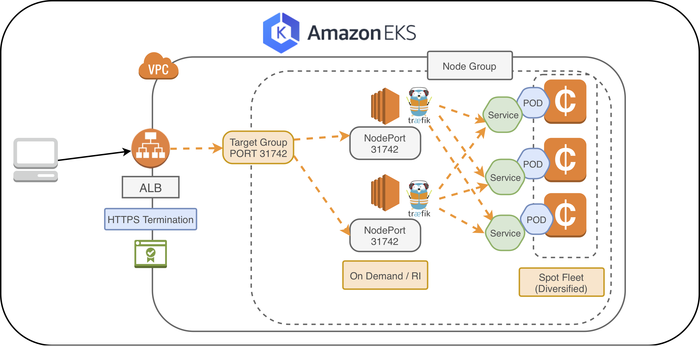
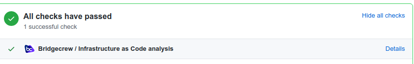
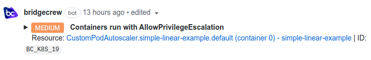
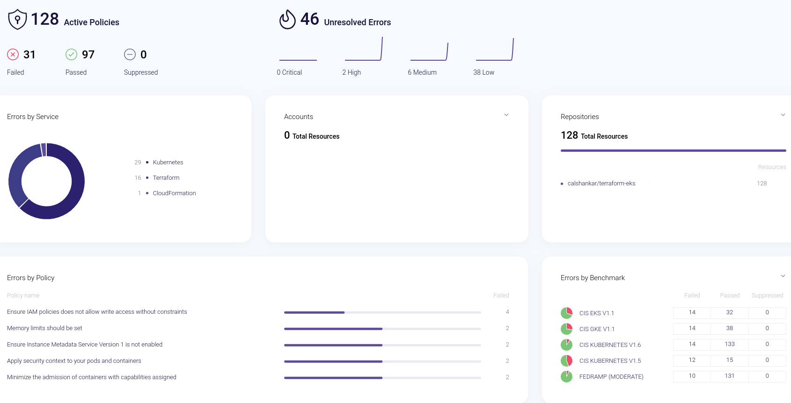

# EKS-Terraform-Setup



EKS setup implementation  using combination of `Terraform` and `Cloudformation` template by AWS with tweaks & customization to user-data. Fully functional templates to deploy your `VPC` and `Kubernetes clusters` together with addons like kube-proxy & kube DNS. Also, worker nodes are part of AutoScallingGroup which consists of spot and on-demand instances.

Curretly it launches only spot to save cost. You can go head & modify the `variable.tf`, `eks-node-group` config to launch on-demand instances.

## Important Assumption

- This doc assumes a working aws-cli setup with suffcient AWS IAM permission to create AWS resource in the module. Please use [aws-vault](https://github.com/99designs/aws-vault) to setup aws credentials securely
- Assumes working kubectl cli matching the version of EKS cluster &  `helm3` local setip for installing cluster addons. `local-null-provisioner` module will fail without it
- The cluster identity is `attached` to the role/user creating the tf resource. This is automatically done for the user & role declared in variables.tf
- RBAC permission must be setup to ensure other user/group h'v permission towards the cluster. More details [here](https://docs.aws.amazon.com/eks/latest/userguide/add-user-role.html)
- Managed node group is created via TF module & unamanged spot node group via aws provided CF teamplate via resource block
- Local provisioner setups extra utilities in the cluster. Make sure the default `values.yaml` are modified or use your own custom kubernetes manifest before enabling the `create_eks_utilities` variable.

Note: `The terraform apply can ***abruptly exit**- [x] while installing EKS-addons. **This is a known issue**. Re-run terraform apply again`

## Tips & Suggestion

- The terraform version `version.tf` is `>=1.0.0`. Ideally any version `>=0.15` should work. Please report any issue
- The module uses env variable for to pass the iam role to setup the cluster
- Supports `kube-bench` integration via service account `pod-reader` which is automatically created. Follow the instructions in additional resource link to set your cluster for `audit`
- The Unmanaged spot node group are tainted with `spotInstance=true:PreferNoSchedule`. Incoming pods must h'v toleration for the taint set
- Unmanaged spot Node group ASG+LT can be a playground for SRE team to experiment with ami/asg/LT configuration before prod rollout, assuming no critical workloads are scheduled. Always use a standby EKS environment for experiments

## Features

- Creates `two` Managed spot node group & `one` Unmanaged spot node group by default
- Initializes custom launch template for `EKS Managed node group` and Unmanaged spot node group
- Nodes in both Managed/Unmanaged spot node group joins the cluster automatically via user-data setup.
- Modifies the auth configmap to include the iam role used by Unamanged nodegroup
- Creates S3 & ECR endpoint for the VPC
- Install cluster addons listed below along with control plan logging enabled
- Cillium is the preferred network plugin over VPC CNI plugin(Disabled by default)
- Automatically Configures cluster & bastion host access from your public IP instead of opening cluster endpoint to WWW. `Ideally, cluster endpoint should be private & accessible via VPN`.
- kubelet garbage collection to clean up the image cache in the worker node when the disk usage reaches 70%
- irsa for pods (`pod_reader`) to assume role with permission to SSM, ECR, S3 & iam assume role
- Repo is integrated with [bridge cloud](https://bridgecrew.io/blog/infrastructure-security-at-scale-with-bridgecrew-for-terraform-cloud/) for infrastruce security scanning & vulnerability scanning against CIS benmarks. Generates detailed categorized error report and Infrastructure as Code analysis
- Predictive Horizontal Pod Autoscaler which preditcs replica count ahead of time. Pls check addons section

`Note: EKS Managed Node Grp, behind the scenes creates a clone of the custom launch template and binds it to the EKS nodegroup. Please note that incrementing the version of the launch template will cause graceful node rollout to the new version. Depends on how soon the running pod can be evicted`

**IAC checks**


**Pull request Warnings:**




## Upcoming feature (WIP...)

- kyverno integration instead of PSP
- Cross-plane intergration
- Custom Addons (more on this later..)
- [Terragoat integration](https://bridgecrew.io/blog/terragoat-open-source-infrastructure-code-security-training-project-terraform/)
- [Bottle-rocket ami support](https://aws.amazon.com/blogs/opensource/getting-started-with-bottlerocket-on-aws-graviton2/)
- containerd as default-runtime instead of docker in EKS-1.21. Use the flag `--container-runtime containerd` during kubelet initialization (supported in EKS-1.21 release ami)

### terraform-aws

To kick-start, you must configure your environment variables in `variables.tf` file, to enable or disable the components that you wish to install as part of EKS setup. Please make sure, to run init/fmt/validate/plan in the order before applying. Optionally you can save run information if you are running locally or use `TF_LOG` env variable.
```
terraform init;terraform fmt;terraform validate;terraform plan
terraform apply -auto-approve 2>&1 | tee <filename>
```

You will find latest setup of following components:

1. VPC with public/private subnets, enabled flow logs and VPC endpoints for ECR and S3
2. EKS controlplane with worker nodes in private subnets. Launched both spot and ondemnd (disabled) instances based on variables flag)
3. Enable or disable configuration of Managed/Unmanaged spot Node Groups via `variables.tf`
4. Automatically configure aws-auth configmap for worker nodes for both Managed & Unmanaged spot node group to join the cluster
5. OpenID Connect provider for assigning IAM roles to service accounts (irsa) in k8s
6. Defautl EKS cluster add-ons (CoreDNS + kube-proxy) supported by EKS
7. NodeDrainer lambda which will drain worker nodes during rollingUpdate of the nodes (This is only applicable to Unmanaged spot Node group).
8. IRSA setup for aws-node authorization, cluster-autoscaler, secrets EBS csi driver & more...
9. Automatic draining od spot instance using node-drainer implementation via Asg lifecycle hook

## Kubernetes Tools + Addons

All the templates for additional deployments/daemonsets can be found in [eks_manifeest](./eks_manifeest/).

To apply templates simply run `kubectl apply -f .` from a desired folder with respective template. Please note some of the addons are automatically installed via `local-null-provisioner`.

Following are the componets that are installed by `default`:

- [x] cilium plugin
- [x] AWS node termination handler
- [x] CoreDns
- [x] Dashboard
- [x] Kube Proxy
- [x] Priority class
- [x] irsa
- [x] [Predictive Horizontal Pod Autoscaler](https://predictive-horizontal-pod-autoscaler.readthedocs.io/en/latest/user-guide/getting-started/)

Following addons installation is controlled via tf-variable `create_eks_utilities`. This variable is disabled by default. You **need to enable it to support addon installation** mentioned below.

Addons(WIP..):

- [x] Cluster Autoscaler
- [x] External-DNS
- [x] Node Termination Handler
- [x] Prometheus operator
- [x] Secrets EBS CSI Driver
- [x] Metrics server
- [x] AWS load balancer controller
- [x] Reloader
- [x] Cert Manager
- [x] Spot Interrupt Handler
- Kube-state-metrics
- [Priority Expander](https://github.com/kubernetes/autoscaler/blob/master/cluster-autoscaler/expander/priority/readme.md)
- [Event Router](https://github.com/heptiolabs/eventrouter)

## Docs and other additional resources

### EKS Release Notes

[EKS-1.21](https://aws.amazon.com/blogs/containers/amazon-eks-1-21-released/)
[EKS-1.20](https://aws.amazon.com/blogs/containers/amazon-eks-1-20-released/)
[Road-Map](https://github.com/aws/containers-roadmap/issues)

### Amazon EKS Addons
[Amazon EKS Addons](https://aws.amazon.com/blogs/containers/introducing-amazon-eks-add-ons/)

### EKS + Aws Security Hub + Kube-bench with Aquasecurity

[Kube-bench implementation with EKS](https://www.youtube.com/watch?v=dAWCbKVLOTU)

### Amazon EKS design, use of spot instances and cluster scaling

[EKS Spot design](https://aws.amazon.com/blogs/compute/cost-optimization-and-resilience-eks-with-spot-instances/)

### IAM Roles for service accounts using OpenID Connect

[Using OIDC provider to allow service accounts to assume IAM role](https://aws.amazon.com/blogs/opensource/introducing-fine-grained-iam-roles-service-accounts/)

### External DNS

[Amazon EKS, setup external DNS with OIDC provider](https://github.com/kubernetes-sigs/external-dns/blob/master/docs/tutorials/aws.md)

### EKS Managed Node Groups

[Amazon EKS + managed node groups](https://aws.amazon.com/blogs/containers/catching-up-with-managed-node-groups-in-amazon-eks/)
[Managed spot Node group](https://aws.amazon.com/blogs/containers/amazon-eks-now-supports-provisioning-and-managing-ec2-spot-instances-in-managed-node-groups/)

Check the Terraform module from modules dir

### Useful resources

[EKS platforms information](https://docs.aws.amazon.com/eks/latest/userguide/platform-versions.html)
[Worker nodes upgrades](https://docs.aws.amazon.com/eks/latest/userguide/update-stack.html)

## Generate kubeconfig file

The local provisioner automatically configures kubeconfig, assuming the aws cli setup is working. Anyway for manual config, here is the command..

```bash
$ aws eks list-clusters
$ aws eks update-kubeconfig --name ${cluster_name}
```
